# Chromion Optimistic Oracle

A modular and extensible optimistic oracle system built for cross-chain Real World Asset (RWA) resolution. This oracle allows trust-minimized data submission, dispute resolution, and reward distribution using a challenge-based process with a focus on decentralization and verifiability.

## ❓ Problem & 💡 Solution

### The Problem

On-chain protocols increasingly depend on **off-chain facts** – such as whether a real-world asset exists, whether a borrower defaulted, or whether a shipment arrived. Verifying such claims is difficult, especially when:

- Data exists **off-chain** or across **multiple chains**
- Trusted third parties introduce **centralization risks**
- Existing oracles aren't designed for **binary truth resolution**
- There’s no incentive-aligned framework for **dispute and escalation**

Moreover, **Real World Assets (RWAs)** bring massive value on-chain, but lack a general-purpose system for **decentralized truth arbitration** tied to those assets.

---

### Our Solution

This protocol introduces an **Optimistic Oracle for Arbitrary Claims**, which allows anyone to request a truth assertion and resolve it through a transparent, incentive-aligned process:

- 🔁 **Cross-chain requests** with full support for **multi-chain deployment**
- 🔍 **Optimistic answering** – answers are accepted unless challenged
- ⚖️ **Dispute resolution** via staking-based challenges and community reviews
- 💰 **USDC-denominated bonding and rewards**, ensuring economic alignment
- 🏗️ **Modular contracts** for flexibility and upgradeability

Whether the claim is about the valuation of a real-world asset or a simple yes/no assertion about an event, this oracle brings decentralized truth to every chain – without sacrificing security or efficiency.

## 🏆 Hackathon Context

- Built for: **Chromion: A Chainlink Hackathon (2025)**
- Devfolio: https://chromion-chainlink-hackathon.devfolio.co/overview
- Team: `Equolibrium`
- Tracks:
  - DeFi
  - Cross-Chain
  - Avalanche
- Chainlink Usage:
  - ✅ CCIP
  - ✅ Automation
  - ❌ VRF for coinflipping challenge + review draws
  - ❌ Functions for AI Scoring (planned)

## 🌐 Project Structure

This repository consists of the following key components:

### `src/`

Smart contracts implementing the core logic:

- `BaseRequestContract`: Abstract request interface used for various request types (RWA valuation, boolean questions).
- `RequestFactory`: Creates request contracts using minimal proxies for gas efficiency.
- `OracleCoordinator`: Handles proposal submission, challenges, reviews, and finalization.
- `RequestScoringRegistry`: Stores all AI generated scorings related to creates requests

### `graph/`

Subgraph configuration (The Graph Protocol) to index on-chain data:

- `schema.graphql`: GraphQL schema for events and request metadata.
- `subgraph.yaml`: Configuration file for event handlers.
- `mappings/`: Contains event mappings and handler logic in AssemblyScript.

### `ai-scorer/`

AI-based scoring service for request validation and consistency

- Uses OpenAI to evaluate question and context information
- It creates a context-aware scoring and stores it on-chain

---

## 🧱 Workflow Overview

```mermaid
graph TB
    %% Styling
    classDef oracleChain fill:#e1f5fe,stroke:#0277bd,stroke-width:2px
    classDef requesterChain fill:#f3e5f5,stroke:#7b1fa2,stroke-width:2px
    classDef offChain fill:#fff3e0,stroke:#f57c00,stroke-width:2px
    classDef actors fill:#e8f5e8,stroke:#388e3c,stroke-width:2px
    classDef automation fill:#00e4ec,stroke:#00185b,stroke-width:2px

    %% Requester Chains (Ethereum, Base, etc.)
    subgraph RC["🔗 CROSS CHAIN (Ethereum, Base,...)"]
        direction TB
        FACTORY["`**Request Factory**
        • Submit request
        • Send reward
        • USDC funding
        • CCIP forwarding`"]
        RELAYER["`**CCIP Relayer**
        • Forward Request Creation to Oracle
        • Receives + Forwards Request Status Updates from Oracle`"]
        REQUEST["`**Request**
        • Cross Chain Representation of Request`"]
    end

    %% Oracle Chain (Avalanche)
    subgraph OC["⛰️ ORACLE CHAIN (Avalanche)"]
        direction TB

        COORD["`**Oracle Coordinator**
        • Entry point for requests
        • Manages proposal windows
        • Initiates challenge periods
        • Participant tracking
        • Challenge acceptance
        • Reviewer windows
        • Consensus tallying
        • Request finalization
        • Reward distribution`"]

        FACTORYOC["`**Request Factory**
        • Submit request
        • Send reward
        • USDC funding`"]

        SCOREREG["`**ScoreRegistry**
        • Risk scoring
        • Quality analysis`"]

        RELAYEROC["`**CCIP Relayer**
        • Forward Request Creation to Oracle
        • Receives + Forwards Request Status Updates from Oracle`"]

        REQUESTOC["`**Request**`"]
    end

    %% Chainlink Components
    subgraph CL["`**CHAINLINK COMPONENTS**`"]
        AUTO["`**Chainlink Automation**
        • Automated Finalization
        • Criteria-based triggers`"]

        %% Cross-Chain Communication
        CCIP["`**Chainlink CCIP**`"]
    end


    %% Off-Chain Components
    subgraph OFF["🌐 OFF-CHAIN"]
        FRONTEND["`**Frontend**
        • Multi-role interface
        • Status displays
        • Timer management
        • Event history`"]

        THEGRAPH["`**TheGraph**`"]

        AIS["`**AI Scoring Service**
        • Risk scoring
        • Quality analysis`"]

        OPENAI["`**OpenAI**`"]

        %% AI Scoring
        subgraph AISCORING["Scoring"]
            AIS -->|"Check for new requests"| THEGRAPH
            THEGRAPH -->|"delivers new request without scoring"| AIS
            AIS -->|"Evaluates Risk"| OPENAI 
            OPENAI -->|"Delivers Risk Score based on context"| AIS
            AIS -->|"Stores score for request"| SCOREREG
            SCOREREG --> |"Triggers event"| THEGRAPH
            THEGRAPH --> |"Updates Score For Request"| THEGRAPH
        end

    end

    %% Actors
    subgraph ACTORS["👥 ACTORS"]
        direction LR
        REQUESTER["`**Requester**
        Submit question
        + reward`"]
        
        PROPOSER["`**Proposer**
        Submit answer
        + bond`"]
        
        CHALLENGER["`**Challenger**
        Challenge answers
        + bond`"]
        
        REVIEWER["`**Reviewer**
        Validate correctness
        + bond`"]

        RWA["`**RWA Owner**
        Submit evaluation
        + reward`"]
    end

    %% %% Answer Types
    %% subgraph ANSWERS["📋 ANSWER TYPES"]
    %%     direction TB
    %%     BOOL["`**Boolean Answers**
    %%     True/False responses
    %%     For factual events`"]
        
    %%     RWA["`**RWA Valuation**
    %%     USDC valuations
    %%     ERC-1155 assets
    %%     Subjective pricing`"]
    %% end

    %% %% State Flow
    %% subgraph STATES["🔄 LIFECYCLE STATES"]
    %%     direction LR
    %%     OPEN["Open"] --> PROPOSED["Proposed"]
    %%     PROPOSED --> CHALLENGED["Challenged"]
    %%     PROPOSED --> CHALLENGE_PERIOD["Challenge Period Expires"]
    %%     CHALLENGE_PERIOD --> RESOLVED["Resolved"]
    %%     CHALLENGED --> REVIEW_PERIOD["Review Period Expires"]
    %%     REVIEW_PERIOD --> RESOLVED
    %% end

    %% Connections
    REQUESTER -->|"Creates request"| FACTORY
    FACTORY -->|"Create"| REQUEST
    FACTORY -->|"Init CCIP Request"| RELAYER
    RELAYER -->|"Send message"| CCIP
    CCIP -->|"Forward Request to Oracle"| COORD

    %% oracle chain creation
    REQUESTER -->|"Creates request"| FACTORYOC
    FACTORYOC -->|"Creates"| REQUESTOC
    FACTORYOC -->|"Register"| COORD

    %% oracle chain creation
    RWA -->|"Creates evaluation request"| FACTORYOC
    FACTORYOC -->|"Creates"| REQUESTOC
    FACTORYOC -->|"Register"| COORD

    %% cross chain update
    COORD -->|"Result Notification"| RELAYEROC
    RELAYEROC --> CCIP
    CCIP -->|"Return Result"| RELAYER
    RELAYER -->|"Updates"| REQUEST
        
    FRONTEND -->|"API for Requests"| THEGRAPH
    FRONTEND -->|"Live Data"| COORD

    THEGRAPH -->|"New Requests"| COORD

    %% Apply styles
    class RC,FACTORY,RELAYER,REQUEST requesterChain
    class OC,COORD,FACTORYOC,SCOREREG,RELAYEROC,REQUESTOC oracleChain
    class OFF,FRONTEND,AISCORING,THEGRAPH,AIS,OPENAI offChain
    class ACTORS,REQUESTER,PROPOSER,CHALLENGER,REVIEWER,RWA actors
    class AUTO,CCIP,CL automation
```



---

## 🧠 &nbsp; Core Concepts

### ✅ &nbsp; Optimistic Resolution

- Proposers submit answers with a 100 USDC bond.
- Anyone can challenge an answer with a 100 USDC bond.
- Reviewers can vote (5 USDC bond) on a challenge’s validity.
- Finalization occurs automatically (via Chainlink Automation) or via multisig as fallback.

### 📊 &nbsp; Real World Assets

Use case: Tokenized RWA like gold, real estate, or carbon credits.

RWA requests contain:

- ERC-1155 asset address
- Contextual string data (question, context, truthMeaning)
- Target value in USDC

### 🏛️ &nbsp; Request Lifecycle States

```text
Pending → Open → Proposed → Challenged → Resolved
```

---

## ⚖️ &nbsp; Roles and Access

| Role              | Responsibility                     |
| ----------------- | ---------------------------------- |
| Factory           | Request creation and forwarding    |
| OracleCoordinator | Proposal management and resolution |
| RequestStore      | Status + metadata registry         |
| RewardHandler     | Handles bond/reward distribution   |
| FINALIZER_ROLE    | Finalize eligible requests         |
| Automation        | Time-based auto-finalization       |

---

## 🚀 &nbsp; Getting Started

```bash
forge install
forge build
```

### Test

#### Ignore Integration Testing

```shell
forge test --no-match-contract "CrossChainIntegrationTest|OracleRelayerTest"
```

#### full cycle testing on fork (+Integration)

For itegration testing, you have to have configured 2 RPCs in your .env file. Visit https://chainlist.org/ to get a public RPC

```shell
# .env
AVALANCHE_FUJI_RPC_URL=
ETHEREUM_SEPOLIA_RPC_URL=
```

Then you can execute

```shell
forge test
```

### Deploy

Requirements

- create key store account ORACLE_DEPLOYER
- this wallet needs gas tokens to work
- if you want to perform on a local fork, you should use `anvil -f avalancheFuji` for this

```shell
# Deploy on local fork
$ forge script ./script/DeployTestnet.s.sol:DeployTestnet --fork-url http://127.0.0.1:8545 --account ORACLE_DEPLOYER --broadcast
# Deploy on testnets
$ forge script ./script/DeployTestnet.s.sol:DeployTestnet --account ORACLE_DEPLOYER --broadcast
# Deploy on mainnet
# $ forge script ./script/DeployMainnet.s.sol:DeployMainnet --account ORACLE_DEPLOYER --broadcast
```

### Setup Fixtures

```shell
# local fork
$ forge script script/SetupFixturesOracleChain.s.sol:SetupFixturesOracleChain --fork-url http://127.0.0.1:8545 --account ORACLE_DEPLOYER --broadcast
# testnet
$ forge script script/SetupFixturesOracleChain.s.sol:SetupFixturesOracleChain --account ORACLE_DEPLOYER --broadcast

```

## Subgraph

```shell
$ graph codegen
$ graph deploy --ipfs https://ipfs.network.thegraph.com demo-oracle
```

## AI Scorer

### Introduction

Uses ChatGPT for checking wether a oracle request is most likely to get challenged or not. It uses the prompt defined in [ai-scorer/src/utils/prompts.ts](ai-scorer/src/utils/prompts.ts) in order to generate an expected scoring pattern.

### Run AI Scorer (locally)

```shell
$ cd ai-scorer

# you can run it just once
$ npm run execute

# or every 30 seconds
$ npm run execute-loop
```


